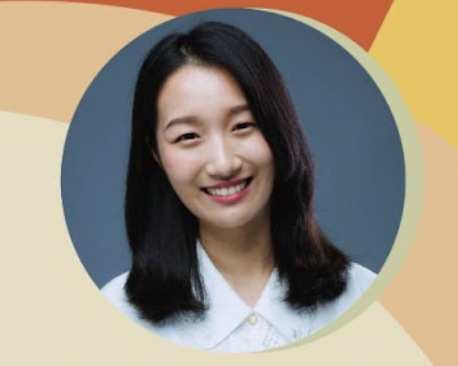

<link rel="stylesheet" href="styles.css">

# 創作者的故事

- 1:00 - 1:45 入場

- 1:45 - 2:00 開場

- {: .speaker-image}
  2:00 - 2:20 從油管和小紅書我學到了什麽？ - Youzang

- {: .speaker-image}
  2:20 - 3:00 中西文化的電影差別 — 奧斯卡與金馬獎前製到後製的幕後推手 - Feyannie Hung

- {: .speaker-image}
  3:00 - 3:45 中場休息
