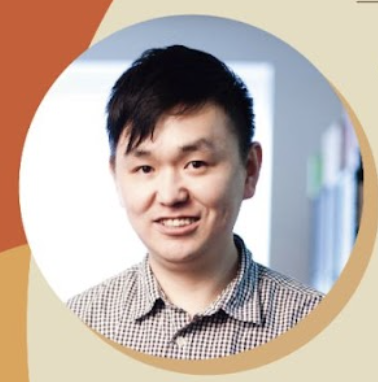
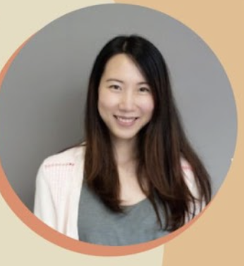
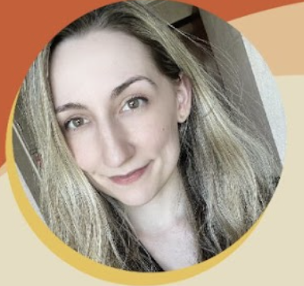

<link rel="stylesheet" href="styles.css">

# 節目單

1:00 - 1:45 入場

1:45 - 2:00 開場

2:00 - 2:20 {: .speaker-image} Youzang - 從油管和小紅書我學到了什麽？

2:20 - 3:00 {: .speaker-image} Feyannie Hung - 中西文化的電影差別 — 奧斯卡與金馬獎前製到後製的幕後推手

3:00 - 3:45 中場休息

3:45 - 4:15 {: .speaker-image} Carrie Kwai - 銷售還是分享：我們做 YouTuber 遇到的挑戰

4:15 - 4:45 {: .speaker-image} Willis Ho - 從零開始：成為好萊塢特效師之路

4:45 - 5:00 休息

5:00 - 5:30 {: .speaker-image} Kelsi May - 一個加拿大女生不小心變成台灣 YouTuber 的故事
